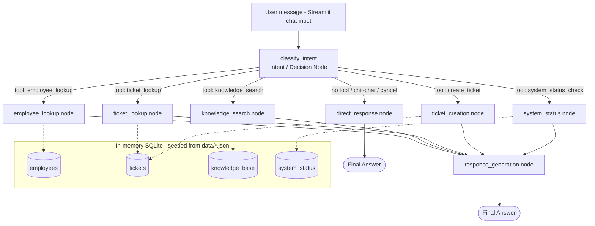

# 🛠️ AI IT Support Assistant (Agentic AI with LangGraph)

A local, agentic AI helpdesk assistant that understands an employee's IT support
request, decides which tool to use, executes it against a local **in-memory SQLite**
database, and returns a clear, safety-checked response — built with **LangChain +
LangGraph** and a **Streamlit** chat UI.

This project was built for the *GenAI Development Program - Final Evaluation Project
(Project 3: AI Operations Assistant Using Agentic AI)*.

---

## 1. Problem Statement

Employees need a fast, self-service way to:
- Find answers to common IT problems (VPN, Wi-Fi, email, hardware, security, etc.).
- Check the status of support tickets they've already raised.
- Raise a new ticket when self-service doesn't resolve the issue.
- Know if a company IT service (VPN, Email, Wi-Fi, ...) is currently having an outage.

Doing this manually means digging through a wiki, emailing IT, or opening a ticketing
portal. This project automates the triage step with an **agent** that reasons about the
request, calls the right tool(s), and only acts after the required information has been
validated — without ever inventing data.

## 2. Solution Overview

The assistant is a **LangGraph** state machine wrapped in a **Streamlit** chat UI:

1. The user types a message.
2. An **intent/decision node** figures out whether a tool is needed (knowledge search,
   ticket lookup, ticket creation, employee verification, system status) — using an LLM
   with **function/tool calling** when an API key is configured, or a deterministic
   rule-based classifier otherwise (see [Key Design Decisions](#7-key-design-decisions)).
3. **Conditional edges** route the request to the correct tool node.
4. Tool nodes execute against a **local, in-memory SQLite database** seeded from the
   sample JSON data in `data/` — no external/remote database is used.
5. Safety nodes enforce validation: missing information is asked for, duplicate tickets
   are flagged, and ticket creation always requires an explicit user confirmation.
6. A **response generation node** turns the tool result into a clear, user-friendly
   answer, distinguishing retrieved facts from any LLM-phrased recommendation.
7. Conversation memory (employee identity, pending confirmations, partially-filled
   ticket drafts, full chat history) is persisted per browser session using LangGraph's
   built-in `MemorySaver` checkpointer.

## 3. Architecture

Full architecture diagrams (system/component view + detailed LangGraph workflow) are in
[docs/architecture.md](docs/architecture.md). Summary view:



**State** (`src/agent/state.py`) is a single `TypedDict` (`AgentState`) covering the
conversation's messages, the verified employee, any pending confirmation/slot-filling
step (`pending_action` / `resume_intent`), a partially-built ticket draft, the last tool
result, and an audit trail (`trace`) shown in the Streamlit sidebar.

**Conditional routing** (`route_after_intent` in `src/agent/nodes.py`) inspects both the
freshly classified tool call *and* any in-flight `pending_action` (e.g. "waiting for an
employee ID", "waiting for yes/no on a ticket confirmation") to decide the next node.

## 4. Technology Stack

| Layer                | Technology                                             |
|----------------------|---------------------------------------------------------|
| Agent orchestration  | LangGraph (`StateGraph`, conditional edges, `MemorySaver`) |
| LLM / tool calling   | LangChain (`bind_tools`), OpenAI or Google Gemini (optional) |
| Fallback reasoning   | Deterministic rule-based classifier (no API key required) |
| Data storage         | SQLite, **in-memory** (`sqlite3.connect(":memory:")`) |
| UI                   | Streamlit chat interface |
| Config               | `python-dotenv` + a typed `Settings` dataclass |
| Logging              | Python `logging` module |

No external or paid infrastructure is required to run the app end-to-end.

## 5. Project Structure

```
Support Assistant Agent/
├── app.py                        # Streamlit entry point
├── requirements.txt
├── .env.example
├── data/                         # Sample data (loaded into the in-memory DB at startup)
│   ├── employees.json
│   ├── knowledge_base.json
│   ├── system_status.json
│   └── tickets_seed.json
├── sample_outputs/
│   └── sample_conversation.md    # Captured end-to-end transcript
├── scripts/
│   └── smoke_test.py             # Dev-only script exercising all conversation flows
└── src/
    ├── config.py                 # Env-driven Settings
    ├── database/
    │   └── db.py                 # In-memory SQLite: schema, seeding, reset, connection
    ├── tools/                    # LangChain @tool-decorated functions
    │   ├── knowledge_search.py   # Tool 1
    │   ├── ticket_lookup.py      # Tool 2
    │   ├── ticket_creation.py    # Tool 3 (+ duplicate detection helper)
    │   ├── employee_lookup.py    # Supporting tool (employee verification)
    │   └── system_status.py      # Bonus tool (service status)
    ├── agent/
    │   ├── state.py              # AgentState TypedDict
    │   ├── llm.py                # OpenAI/Gemini provider selection (or None = fallback)
    │   ├── rules.py               # Deterministic fallback classifier + safety helpers
    │   ├── nodes.py              # All LangGraph node functions + routing function
    │   └── graph.py              # Wires nodes/edges into a compiled LangGraph app
    └── utils/
        └── logging_config.py     # Basic logging setup
```

## 6. Setup Instructions

### Prerequisites
- Python 3.10+
- No external services required (SQLite is in-memory and built into Python).

### Installation

```powershell
# From the project root
python -m venv .venv
.\.venv\Scripts\Activate.ps1
pip install -r requirements.txt
```

### Environment Variables

Copy `.env.example` to `.env` and (optionally) fill in an LLM API key:

```powershell
copy .env.example .env
```

| Variable            | Required? | Description                                                             |
|---------------------|-----------|---------------------------------------------------------------------------|
| `LLM_PROVIDER`       | No        | `auto` (default), `openai`, `gemini`, or `none` (forces rule-based mode) |
| `OPENAI_API_KEY`     | No        | Enables OpenAI-powered intent understanding & response phrasing         |
| `OPENAI_MODEL`       | No        | Defaults to `gpt-4o-mini`                                                |
| `GOOGLE_API_KEY`     | No        | Enables Gemini-powered intent understanding & response phrasing         |
| `GOOGLE_MODEL`       | No        | Defaults to `gemini-1.5-flash`                                           |
| `LOG_LEVEL`          | No        | `DEBUG` / `INFO` (default) / `WARNING` / `ERROR`                        |

**No API key is required** — without one, the app automatically runs in a deterministic
rule-based mode (see [Key Design Decisions](#7-key-design-decisions)) so it is always
runnable without any paid service.

### Running the Application

```powershell
streamlit run app.py
```

Then open the URL Streamlit prints (typically `http://localhost:8501`).

Use the sidebar to see whether LLM mode or fallback mode is active, which employee (if
any) is currently verified in the session, and a live feed of tool calls made by the
agent. Use **🧹 Clear chat** to reset the conversation/agent memory, or **🔄 Reset data**
to also restore the ticket database to its original sample state.

### Running the Smoke Test (optional, no UI)

```powershell
python scripts\smoke_test.py
```

This runs eight scripted conversations directly against the compiled LangGraph agent
and prints each turn - useful for verifying the setup without opening the browser. See
[`sample_outputs/sample_conversation.md`](sample_outputs/sample_conversation.md) for a
captured transcript.

## 7. Key Design Decisions

- **In-memory SQLite, no external database.** `src/database/db.py` opens a single
  `sqlite3.connect(":memory:")` connection, seeded from the JSON files in `data/` at
  startup, and shared for the lifetime of the Streamlit process via `st.cache_resource`.
  This satisfies the "no external database" requirement while still demonstrating real
  SQL-backed tool implementations. **Trade-off:** created tickets do not persist across
  a full app restart, and (in this simple demo) are shared across all browser sessions
  connected to the same running server — acceptable for a local evaluation project, and
  can be swapped for a file-backed SQLite path with a one-line change if persistence is
  needed.
- **LangGraph `MemorySaver` for conversation state**, keyed by a per-browser-session
  `thread_id`. This is the actual mechanism that satisfies the "Memory / State" and
  multi-turn requirement (e.g. remembering the employee ID and a partially-built ticket
  across turns) - the Streamlit UI simply reads `graph.get_state(...)` to render history.
- **Hybrid LLM / rule-based reasoning.** Open-ended intent classification uses LLM
  **function calling** (`llm.bind_tools([...])`) when an API key is available, so the
  model itself decides which tool to call and with what arguments. Safety-critical steps
  (yes/no confirmations, employee ID extraction) use small deterministic regex-based
  helpers (`src/agent/rules.py`) **regardless of LLM availability**, so a confirmation
  can never be misinterpreted by a hallucinating LLM, and the whole app still works with
  zero API keys.
- **Mandatory confirmation before creating a ticket.** `ticket_creation_node` never
  calls the `create_ticket` tool on the first pass; it always returns a draft summary and
  waits for an explicit "yes" from the user - directly satisfying the "should not blindly
  execute every action" requirement.
- **Duplicate-ticket detection.** Before creating a ticket, `find_duplicate_ticket`
  checks the employee's open/in-progress tickets for keyword overlap with the new issue
  description and asks the user to confirm before creating a near-duplicate.
- **"Escape hatch" out of pending confirmations.** If the user changes the subject while
  a yes/no confirmation is pending (e.g. asks an unrelated question instead of replying
  yes/no), `classify_intent_node` re-attempts a fresh classification and, if a clear new
  intent is found, abandons the stale confirmation instead of getting stuck repeating it.
- **Never-invent-data guarantee.** All ticket IDs, employee names/departments, and
  knowledge base content originate only from tool results (SQLite rows); the LLM is only
  used to *phrase* that retrieved content, and is explicitly instructed not to invent
  details.

## 8. Sample Inputs & Outputs

Sample data ships in `data/` (6 employees, 5 seed tickets, 6 knowledge base articles, 5
service statuses). A full worked transcript covering all 3 required tools plus the bonus
system-status tool, multi-turn memory, duplicate detection, and a declined ticket, is in
[`sample_outputs/sample_conversation.md`](sample_outputs/sample_conversation.md).

Quick examples to try after `streamlit run app.py`:

| Try typing...                                              | What happens |
|--------------------------------------------------------------|--------------|
| `How do I reset my VPN password?`                             | Knowledge search → KB001 |
| `What is the status of my laptop issue?` → `EMP1024` → `yes`  | Multi-turn ticket lookup (matches the assignment's example flow) |
| `My VPN is not working, please raise a ticket` → `yes`        | Ticket creation with confirmation |
| `Is the WiFi down?`                                           | System status check |

## 9. Limitations

- The in-memory database resets whenever the Streamlit process restarts (by design, per
  the "no external database" requirement) - use **🔄 Reset data** to reset it manually.
- The rule-based fallback classifier (used when no LLM key is set) understands a smaller
  set of phrasings than an LLM would; it is a safety net, not a replacement for genuine
  NLU.
- Duplicate-ticket detection uses a simple keyword-overlap heuristic, not semantic
  similarity - it will not catch every paraphrase of an existing issue.
- The Streamlit `@st.cache_resource` database connection is shared by all sessions on
  the same running server process (single-process demo scope, not multi-tenant safe).
- No authentication layer - this is a local demo assistant, not a production helpdesk.
