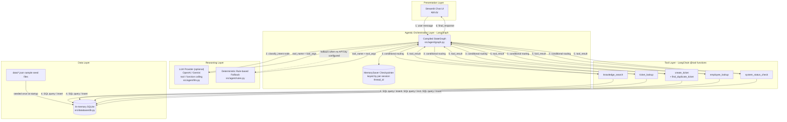
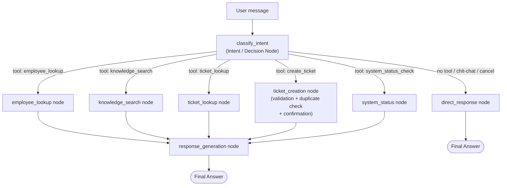

# Architecture - AI IT Support Assistant

This document is the dedicated architecture diagram/reference for the project (see
also [README.md](../README.md) for the narrative overview).

## 1. System / Component Architecture

## 2. LangGraph Workflow (State, Nodes, Conditional Routing)

## 3. Component Responsibilities

| Component | File(s) | Responsibility |
|---|---|---|
| Streamlit UI | `app.py` | Chat input/history, sidebar (session status, tool trace, clear/reset), error display |
| Agent state | `src/agent/state.py` | `AgentState` TypedDict - messages, employee identity, pending confirmations, ticket draft, trace |
| Intent/decision | `src/agent/nodes.py::classify_intent_node` | LLM tool-calling or rule-based fallback; interprets replies to pending confirmations |
| Conditional routing | `src/agent/nodes.py::route_after_intent` | Chooses next node from tool_name / pending_action / reply type |
| Tool nodes | `src/agent/nodes.py` | Slot validation, calls the matching `@tool`, updates state |
| Tools | `src/tools/*.py` | LangChain `@tool` functions executing SQL against the in-memory DB |
| Data layer | `src/database/db.py`, `data/*.json` | In-memory SQLite schema + seeding + reset |
| LLM selection | `src/agent/llm.py` | Picks OpenAI/Gemini based on `.env`, or `None` for fallback mode |
| Rule-based fallback | `src/agent/rules.py` | Regex/keyword classification, confirmations, category inference - used with or without an LLM |
| Response generation | `src/agent/nodes.py::response_generation_node` | Turns tool_result into the final user-facing message |
